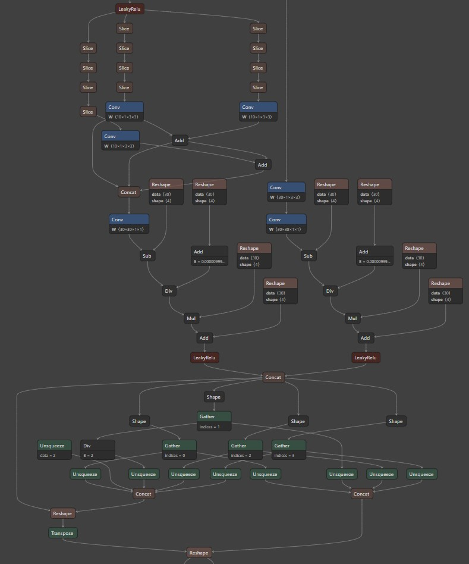
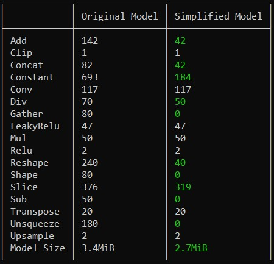
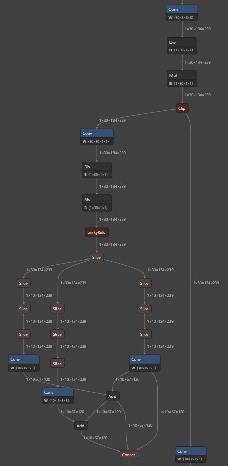

# ONNX model optimization tools overview

Optimization tools make DNN models faster and less resources consuming. There aren't much ONNX models optimization tools (I've managed to find only two actually), DNN optimization 
itself has very few ready-to-use tools, so we'll try to get as much as we can from ones described below.

## ONNXOptimizer

[source](https://github.com/onnx/optimizer)

Basically, reduces model "length": this optimization tool reduces number of operations during model inference making it faster and less resources consuming.
I've splitted OnnxOptimizer implemented optimizations into two major categories.

### Elimination optimizations

Eliminates unnessesary operations like dropout, these operations are not used during inference,
so could be removed without any NN stress. Lots of operations are being replaced during this optimizations by combinations 
of simpler ops (e.g. flatten, pad, concat, etc.).
Some other operations like if-operators with constant condition or monotone argmax also are being removed.

### Fuse optimizations

Fuse optimizations reduce number of operations by merging: 
* add convolution bias to its weight;
* integrate pre-calculated batch normalization (for trained model obviously) into convolution weights;
* merge cosecutive operations.

## ONNXSimplifier 

[source](https://github.com/daquexian/onnx-simplifier/)

This optimization tool reduces model "width": redundant parallel operations arising as a result of 
model conversion from other formats are being "simplified" by replacing them with less number of ops.
Also constant folding is performed: some operations are being replaced with constants.

### Example

I've found pretty complicated model: it has custom BatchNorm and 
shuffle-net like layers [model source](https://github.com/JDAI-CV/DNNLibrary/issues/17#issuecomment-455934190)

I will use [Netron](https://github.com/lutzroeder/netron) to visualize part of model architecture:

OnnxSimplifier displays comparison table of before/after number of operations (and results are awesome):

And here is the same part of simplified model:

These are pretty incredible results. As of my personal experience, models often lose only few ops (and sometimes none).
Though, even with less real-world efficiency this tool may reduce your model inference time 
and its disk space consumption a little bit. Anyway, looking on model graph change during simplification it seems impressive.

## ONNXRuntime graph optimizations

[source](https://onnxruntime.ai/docs/performance/model-optimizations/graph-optimizations.html)

Most of optimizations described below are implemented either in OnnxOptimizer or OnnxSimplifier, so they will be described briefly.

### Basic optimizations
These are semantics-preserving graph rewrites which remove redundant nodes and redundant computation:
* Constant Folding;
* Redundant node eliminations (identity, slice, dropout, etc.);
* Semantics-preserving node fusions (conv-batchnorm fusion, reshape fusion, etc.);

### Extended graph optimizations
These optimizations include complex node fusions. They are run after graph partitioning. Only available with CPU, CUDA 
or ROCm execution providers.

* GELU function fusion and/or approximation;
* Attention fusion;
* and many others (full list of extended optimizations may be found [here](https://onnxruntime.ai/docs/performance/model-optimizations/graph-optimizations.html#extended-graph-optimizations)

### Layout optimizations

These optimizations change the data layout for applicable nodes to achieve higher performance improvements. 
They are run after graph partitioning and are only applied to nodes assigned to CPU execution provider.

## Tensorflow, PyTorch and ONNXRuntime comparison (w/ and w/o described optimizations)

I've decided to use [CRNN](https://arxiv.org/abs/1507.05717) for better experiment. It has convolutional, reccurrent and dense layers,
so we'll be able to witness optimizations impact on different NN builing blocks.

I didn't include torch2onnx converted model results without optimizations because (I guess) torch.onnx module automatically 
applies optimizations (results were identical)

<pre>
+--------------------------+-------------+-------------+-----------------+------------+---------------+-------------------------+
|  Optimization type       |   Runtime   |   #Params   | Inference time  | Loss value | Metric value  | Saved model size (KB)   |
|                          |             |             | (ms per batch)  |            |               |                         |
+--------------------------+-------------+-------------+-----------------+------------+---------------+-------------------------+
| Original model           |   TF        |   1.492M    |     53.708      |  0.293844  |   0.002215    |       17_623 (h5)       |
+--------------------------+-------------+-------------+-----------------+------------+---------------+-------------------------+
| Original model           |   PT        |   1.492M    |     3.886       |  14.04322  |   0.049891    |  5849 (state dict .pt)  |
+--------------------------+-------------+-------------+-----------------+------------+---------------+-------------------------+
| tf2onnx converted        | ONNXRuntime |   1.492M    |     29.454      |  0.293844  |   0.002215    |           5835          |
+--------------------------+-------------+-------------+-----------------+------------+---------------+-------------------------+
| torch2onnx converted     | ONNXRuntime |   1.492M    |     8.122       |  0.611737  |   0.047295    |           5849          |
| + ONNXOptimizer          |             |             |                 |            |               |                         |
| + ONNXSimplifier         |             |             |                 |            |               |                         |
+--------------------------+-------------+-------------+-----------------+------------+---------------+-------------------------+
| tf2onnx converted        | ONNXRuntime |   1.492M    |     28.541      |  0.293844  |   0.002215    |           5837          |
| + ONNXOptimizer          |             |             |                 |            |               |                         |
| + ONNXSimplifier         |             |             |                 |            |               |                         |
+--------------------------+-------------+-------------+-----------------+------------+---------------+-------------------------+
</pre>

Also make sure to check out my DNN model optimization repo where I implement and compare optimization techniques: https://github.com/K0mp0t/DNN_Model_optimization

## Resources

[ONNXOptimizer](https://github.com/onnx/optimizer)
[ONNXSimplifier](https://github.com/daquexian/onnx-simplifier/)
[Netron](https://github.com/lutzroeder/netron)
[ONNXRuntime](https://github.com/microsoft/onnxruntime)
[ONNXRuntime graph optimizations](https://onnxruntime.ai/docs/performance/model-optimizations/graph-optimizations.html)

